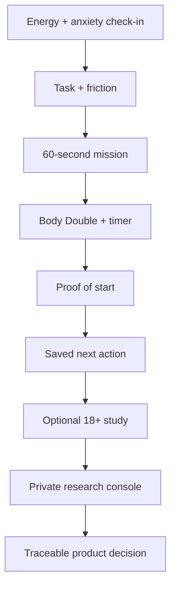

# Start Now ⚡

[](https://github.com/Cyberchopin/startnow-2/actions/workflows/ci.yml)


**An adaptive task-start coach for people who know what matters but still cannot begin.**

Start Now turns an overwhelming long-term project or job application into one concrete 60-second action. It targets the executive-function gap before productivity tools become useful: the moment between intention and physical action.

> The hosted study is currently in controlled-access research mode. Public testing will open only after the research guardrails and consent workflow are verified.


## Why this is different

Most productivity products optimize planning, schedules, or task volume. Start Now does not generate another plan. It asks for ten seconds of context, shrinks the next action until it is physically startable, stays present through the first minute, and requires proof before awarding a streak.

| User barrier | Product response | Evidence captured |
| --- | --- | --- |
| “I do not know where to begin” | Clarifies one visible entry point | Time to start + proof |
| “It feels too big” | Repeatedly removes scope | Number of mission shrinks |
| “I am afraid I will do it badly” | Makes the action reversible | Before/after overwhelm |
| “I have no energy” | Reduces physical effort | Return behavior + feedback |

## Working product

- Adaptive energy, anxiety, task-type, and friction check-in
- Explainable 60-second mission generation
- Optional voice Body Double using browser speech synthesis
- Pause, stuck rescue, proof-of-start, and saved next action
- Device-local journeys, honest streaks, and friction insights
- Anonymous 18+ study flow backed by Cloudflare D1
- Owner-only Research Console with server-side authorization
- Feedback classification and **User said → We changed → Why** decision log
- Hashed hourly submission throttling, UUID validation, and honeypot defense
- Responsive and reduced-motion-aware interface

## Product and research flow



## Hackathon evidence standard

This repository deliberately separates product claims from evidence:

1. A streak advances only after a specific proof of action.
2. The public study endpoint exposes aggregate metrics, never raw feedback.
3. Raw responses require server-side owner authorization.
4. Every product decision records the user evidence, the change, and the rationale.
5. The next submission milestone is 5–10 consented adult usability sessions and at least three evidence-linked decisions.

Start Now is an experimental hackathon prototype, not a medical device, diagnosis tool, or substitute for professional care.

## Stack

- TypeScript, React 19, Next.js-compatible App Router
- Vinext + Vite on Cloudflare Workers
- Cloudflare D1 + Drizzle ORM
- Sign in with ChatGPT identity headers for protected research access
- Dependency-light CSS interface

## Run locally

Requires Node.js 22.13+.

```bash
npm install
cp .env.example .env.local
npm run dev
```

On Windows PowerShell:

```powershell
npm install
Copy-Item .env.example .env.local
npm run dev
```

Set these values in `.env.local`; never commit that file:

```env
RESEARCH_OWNER_EMAILS=owner@example.com
STUDY_RATE_LIMIT_SALT=replace-with-a-long-random-value
```

## Validate

Linux/macOS/WSL uses the bounded production build:

```bash
npm run lint
npm run build
```

Native Windows can run the portable equivalent:

```powershell
npm run lint
npm run build:portable
```

Schema changes require a reviewed migration:

```bash
npm run db:generate
```

GitHub Actions repeats install, lint, production build, artifact checks, and rendered-output tests for every PR.

## Privacy and abuse controls

- Participants are asked not to submit names, contact details, schools, links, or diagnosis details.
- Consent is restricted to adults 18+ in this prototype.
- Device keys must be valid UUIDs and are unique in D1.
- Submission attempts are throttled with an hourly salted hash; raw IP addresses are not stored.
- A hidden honeypot quietly drops obvious automated submissions.
- `/api/research` authorizes every read and write on the server.
- Production must configure `RESEARCH_OWNER_EMAILS` and a long random `STUDY_RATE_LIMIT_SALT` before public testing.

## Repository map

```text
app/                  Product UI, study API, protected research console
db/                   Drizzle schema and D1 bridge
drizzle/              Versioned D1 migrations
worker/               Cloudflare Worker entry point
scripts/              Reproducible and portable build validation
.github/workflows/    Continuous integration
.openai/hosting.json  Sites binding declaration
```

## Project status

- Product experience: functional
- Research Console: functional, owner-only
- Public recruitment: intentionally not opened yet
- Next gate: configure production secrets, validate abuse controls, then recruit real testers

## License

No open-source license has been selected. All rights reserved by the project owner.
