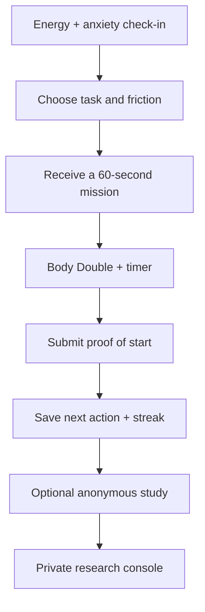

# Start Now ⚡

**An adaptive task-start coach for people who know what matters but still cannot begin.**

Start Now turns an overwhelming goal—especially a long-term personal project or job application—into one concrete 60-second action. It combines a low-friction check-in, adaptive mission sizing, optional voice body doubling, proof of start, real streaks, and an evidence-driven research workflow.

🌐 Live product: https://start-now-ai.wangshiyue1128.chatgpt.site

## The problem

Most productivity products optimize planning, scheduling, or task volume. They still assume the user can initiate the task. Start Now targets the moment before action: high anxiety, low energy, ambiguous next steps, perfectionism, and executive-function friction.

## What is real in this build

- Adaptive check-in for energy, anxiety, task type, and current friction
- Rule-based generation of a concrete 60-second starting mission
- Voice Body Double using browser speech synthesis
- Pause, stuck rescue, proof-of-start, and next-action capture
- Device-local history, streaks, journeys, and friction insights
- Anonymous 18+ user-study flow backed by Cloudflare D1
- Owner-only Research Console with server-side authorization
- Feedback categorization and review workflow
- Traceable **User said → We changed → Why** product decision log
- Responsive and reduced-motion-aware interface

## Product flow



## Tech stack

- TypeScript, React 19, Next.js-compatible App Router
- Vinext and Vite for Cloudflare Workers
- Cloudflare D1 with Drizzle ORM
- Sign in with ChatGPT identity headers for the protected research console
- CSS-first responsive interface; no UI component dependency

## Run locally

Requirements: Node.js 22.13+ and a Linux/macOS shell environment.

```bash
npm install
cp .env.example .env.local
npm run dev
```

Set `RESEARCH_OWNER_EMAILS` to a comma-separated allowlist of owner emails. Never commit `.env.local`.

## Validate

```bash
npm run lint
npm run build
```

After changing `db/schema.ts`, generate and review a migration:

```bash
npm run db:generate
```

## Privacy and research guardrails

- The public study endpoint returns aggregate counts only.
- Raw feedback is available only through `/api/research`, which performs server-side owner authorization for every read and write.
- The study asks participants not to provide names or contact details.
- Consent is restricted to adults 18+ in this prototype.
- One study response is accepted per device key.

This is an experimental hackathon prototype, not a medical device or diagnostic tool.

## Repository structure

```text
app/                 Product UI, study API, and protected research console
db/                  Drizzle schema and D1 access
drizzle/             Versioned database migrations
worker/              Cloudflare Worker entry point
scripts/             Reproducible build and artifact validation
.openai/hosting.json Sites binding declaration
```

## Why the Research Console matters

The project does not claim impact from a polished interface alone. The private console turns anonymous feedback into categorized evidence and forces every product decision to document what a participant said, what changed, and why. That creates an auditable research trail for future hackathon evaluation.

## License

No open-source license has been selected yet. All rights reserved by the project owner.
