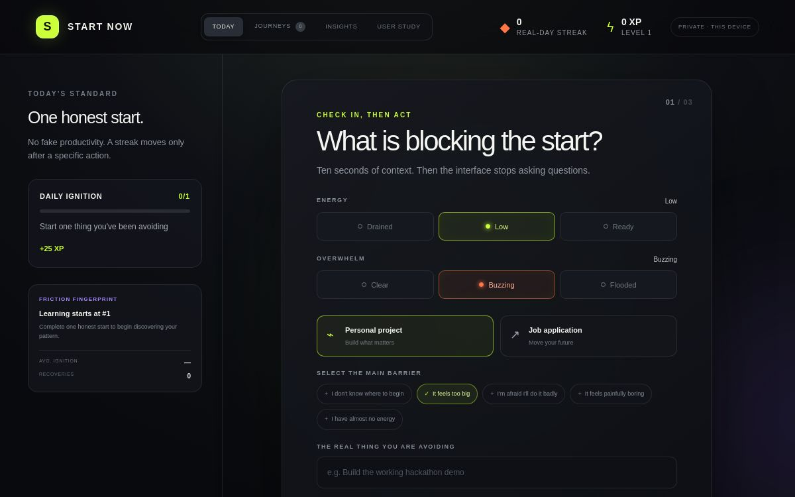
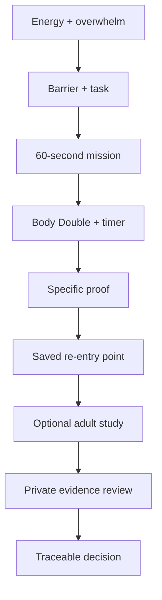
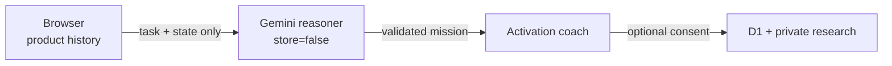

# Start Now ⚡

[](https://github.com/Cyberchopin/startnow-2/actions/workflows/ci.yml)


**A 60-second activation coach for people who know what matters—but still cannot begin.**

Most productivity tools assume the user has already started. Start Now is built for the missing moment before that: when a job application, portfolio, or long-term project feels too unclear, too large, or too emotionally expensive to touch.

It turns ten seconds of context into one physically startable action. Gemini 3.6 Flash reasons over the user's current capacity and barrier, a deterministic safety path takes over when the model is unavailable, and progress is awarded only after proof of action.

> **Current status:** functional research prototype. The hosted study remains controlled-access until production secrets, consent, and abuse controls complete final verification.



## The activation gap

Planning is not the same as starting. A user can have a perfect task list and still be unable to perform the first physical action.

Start Now focuses on a narrower, measurable question:

> **Can the product reduce the time and emotional load between intention and action?**

| Barrier in the user's words | Start Now changes | Signal captured |
| --- | --- | --- |
| “I don't know where to begin” | Exposes one visible entry point | Seconds to start |
| “It feels too big” | Repeatedly removes scope | Mission shrink count |
| “I'm afraid I'll do it badly” | Makes the action reversible | Overwhelm before/after |
| “I have almost no energy” | Reduces physical effort | Completion and return behavior |

## Try the core loop in 90 seconds

1. Choose a real long-term project or job application.
2. Check in with your energy, overwhelm, and current barrier.
3. Receive one 60-second mission—not another plan.
4. Start with an optional spoken Body Double beside you.
5. If the mission is still too large, shrink it again or use stuck rescue.
6. Submit specific proof of what physically changed.
7. Save the exact re-entry point for the next session.

The product then learns from device-local history: common barriers, typical shrink depth, ignition time, and whether starting actually reduced overwhelm.

## Why this is not another to-do app

- **Activation, not organization:** the success event is beginning a real task.
- **Adaptive shrinking:** missions respond to energy, anxiety, task type, friction, and prior starts.
- **Proof before points:** vague intention does not advance the streak.
- **Recovery over perfection:** returning after a missed day is treated as progress.
- **Explainable adaptation:** users can see why an action was made smaller.
- **Evidence-to-decision loop:** private feedback can become a traceable **User said → We changed → Why** record.

## What works today

- Adaptive check-in for energy, overwhelm, task type, and friction
- Gemini 3.6 Flash mission reasoning with structured output validation
- Explainable deterministic fallback for outages, missing configuration, or invalid model output
- Optional voice Body Double using browser speech synthesis
- Timer, pause, stuck rescue, proof-of-start, and saved next action
- Device-local journeys, honest streaks, and friction insights
- Anonymous 18+ usability-study flow backed by Cloudflare D1
- Owner-only Research Console with server-side authorization
- Feedback classification and evidence-linked product decisions
- Hashed hourly throttling, UUID validation, and honeypot defense
- Responsive, keyboard-usable, reduced-motion-aware interface

## Product and research loop



## Evidence standard

This repository separates a polished prototype from a validated outcome.

| Claim | Required evidence |
| --- | --- |
| A user started | Specific proof of a physical action |
| A streak advanced | A completed, evidenced activation |
| The intervention helped | Before/after overwhelm and ignition time |
| A product change matters | A decision linked to consented feedback |
| The prototype is ready to scale | Repeated behavior across real sessions |

No fake traction is presented. The next evidence gate is **5–10 consented adult usability sessions**, followed by at least **three feedback-linked product decisions**.

Start Now is an experimental hackathon prototype—not a medical device, diagnostic tool, or substitute for professional care.

## Architecture and privacy boundary



- Personal activation history stays in the browser.
- A mission request sends only the task text and compact check-in state; Gemini Interactions requests use `store=false`.
- Model output must pass a strict schema and safety checks; otherwise the app uses its deterministic fallback.
- Public study summaries contain aggregates, never raw written feedback.
- Raw responses and product decisions require server-side owner authorization.
- Submission attempts use an hourly salted hash; raw IP addresses are not stored.
- Participants are asked not to submit names, contact details, schools, links, or diagnosis details.
- The prototype accepts study consent only from adults 18+.

## Stack

- TypeScript, React 19, Next.js-compatible App Router
- Vinext + Vite on Cloudflare Workers
- Cloudflare D1 + Drizzle ORM
- Gemini Interactions API with structured JSON output
- Sign in with ChatGPT identity headers for protected research access
- Dependency-light CSS interface

## Run locally

Requires Node.js 22.13+.

```bash
npm install
cp .env.example .env.local
npm run dev
```

On Windows PowerShell:

```powershell
npm install
Copy-Item .env.example .env.local
npm run dev
```

Set these values in `.env.local`; never commit that file:

```env
RESEARCH_OWNER_EMAILS=owner@example.com
STUDY_RATE_LIMIT_SALT=replace-with-a-long-random-value
GEMINI_API_KEY=replace-with-a-server-side-google-ai-studio-key
```

## Validate

Linux, macOS, and WSL use the bounded production build:

```bash
npm run lint
npm test
```

Native Windows can run the portable artifact checks:

```powershell
npm run lint
npm run build:portable
npm run validate:artifact:portable
```

Schema changes require a reviewed migration:

```bash
npm run db:generate
```

GitHub Actions repeats dependency installation, linting, the production build, artifact validation, and rendered-output tests for every pull request.

## Repository map

```text
app/                  Product UI, study API, protected research console
db/                   Drizzle schema and D1 bridge
drizzle/              Versioned D1 migrations
worker/               Cloudflare Worker entry point
scripts/              Reproducible and portable build validation
.github/workflows/    Continuous integration
.openai/hosting.json  Sites binding declaration
```

## Roadmap to validation

- [x] Complete the activation loop from check-in to proof
- [x] Protect raw research data behind server-side owner authorization
- [x] Add abuse controls and reproducible CI
- [ ] Configure production secrets and complete the privacy test matrix
- [ ] Run 5–10 consented adult usability sessions
- [ ] Publish three evidence-linked product decisions
- [x] Add a genuine model-backed mission reasoner with schema validation and safe deterministic fallback
- [ ] Record a concise public demo video

## License

No open-source license has been selected. All rights reserved by the project owner.
